# 学生选课管理系统

## 介绍
学生选课管理系统是一个专门为高校提供选课平台，方便学校的课程管理的系统。主要为学生、教师和管理员提供服务。管理员管理系统的基本信息，如课程信息等，学生和教师通过系统完成不同的工作。

## 技术栈
* 前端：pyqt5
* 后端：Python
* 数据库：MySQL

系统在Windows 11上运行。

## 运行环境
* 系统：Windows 11
* 数据库：MySQL
* 开发工具：PyCharm

## 运行方式
在安装有Python、PyQt5、MySQL的Windows 11系统上运行。从stuCourSelMS.py文件开始运行。

## 运行截图
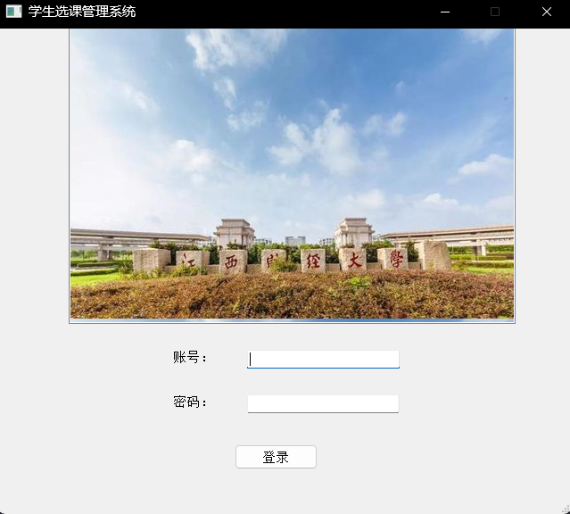
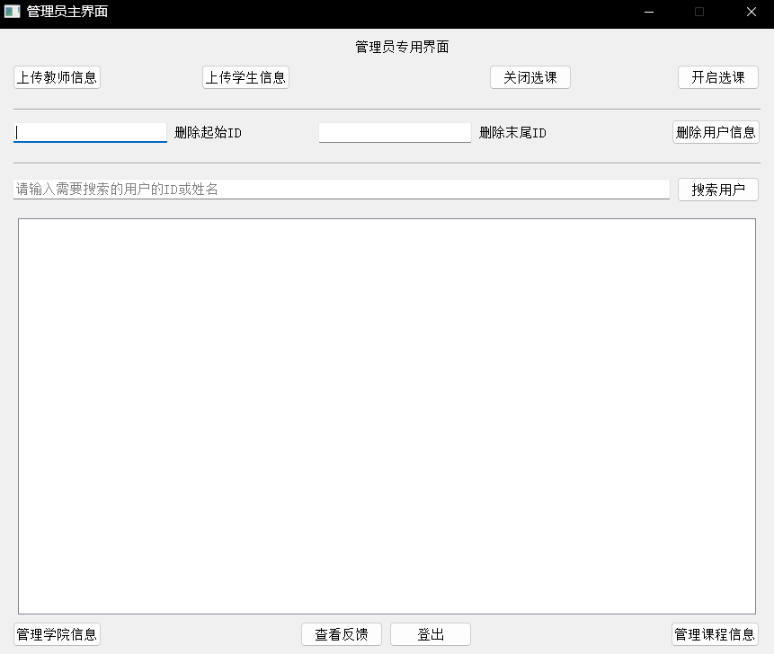
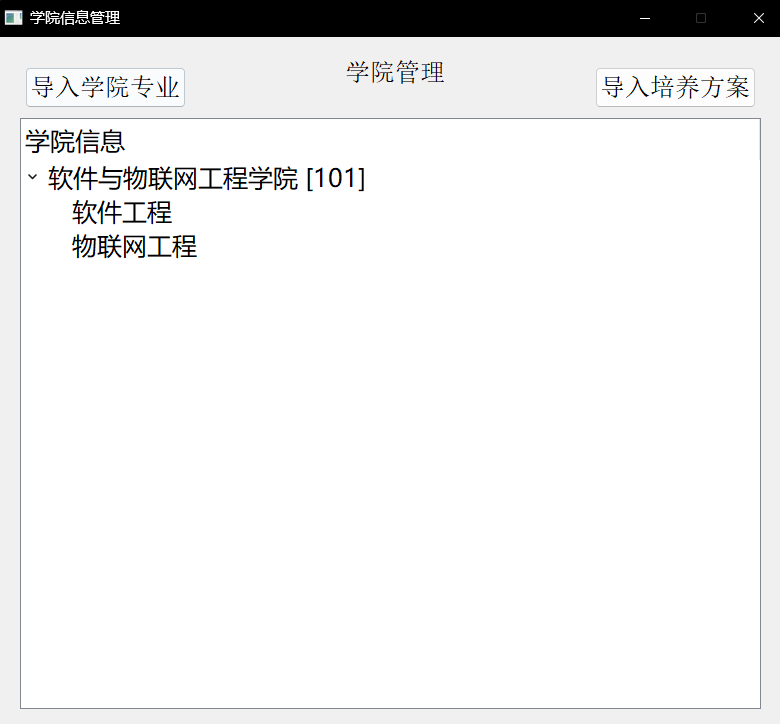
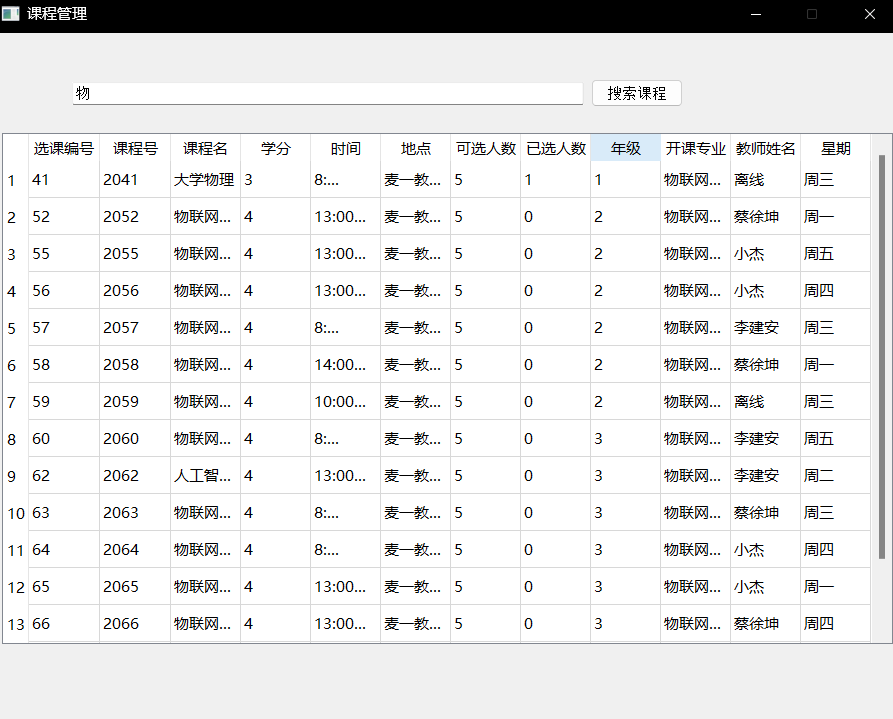
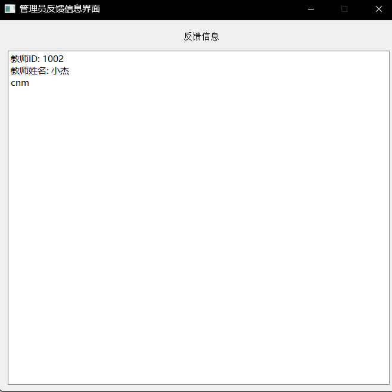
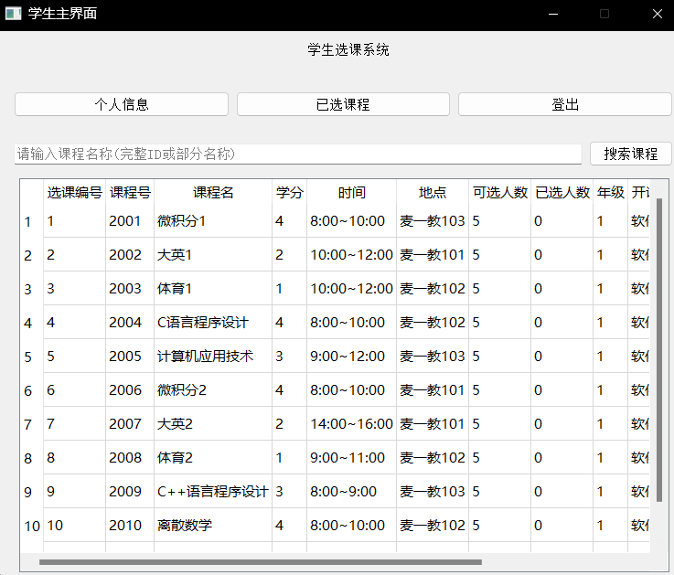
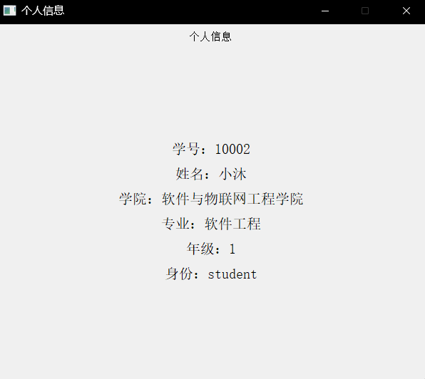
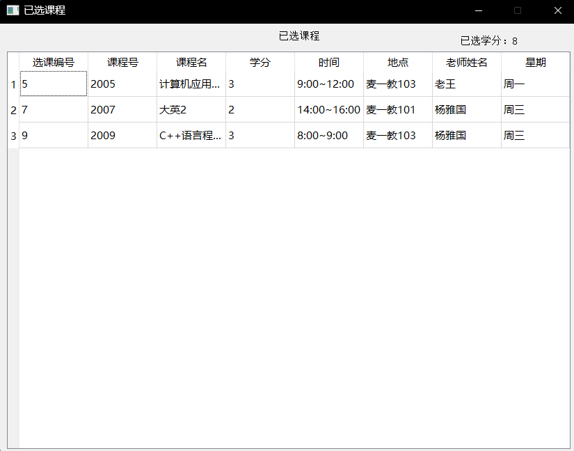
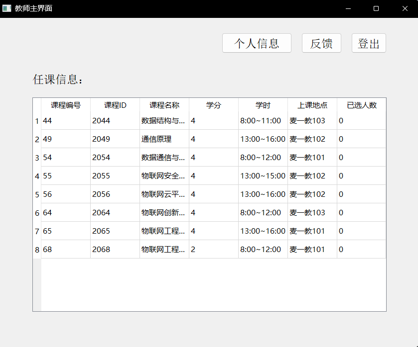
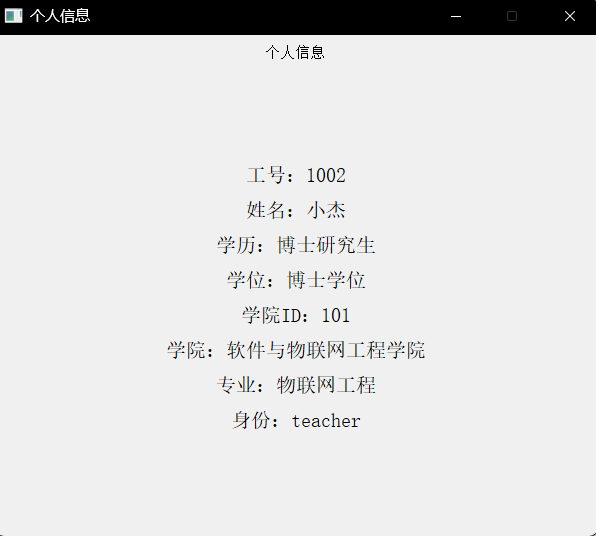
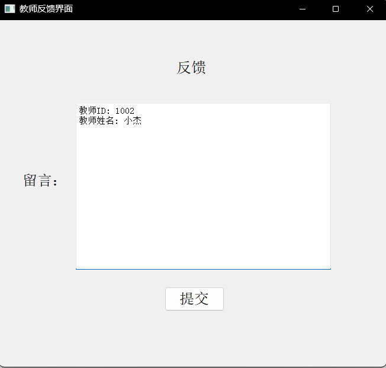